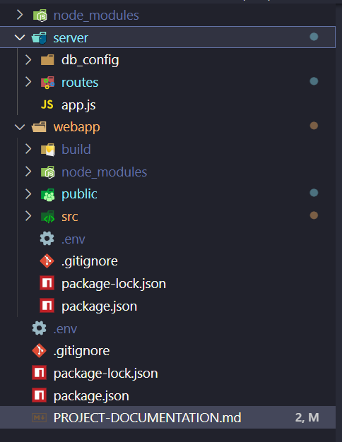

# Recruitment-Test

## Descrição

Este projeto é composto por um backend Node.js (Express) e um frontend React. O backend serve a aplicação React já compilada, tornando possível acessar a interface pelo navegador via rota `/`.

---

## Estrutura do Projeto



---

## Passo a Passo para Rodar o Projeto

### 1. Pré-requisitos

- Node.js (versão 20 recomendada)
- npm (gerenciador de pacotes do Node)

### 2. Instalar as dependências

Na raiz do projeto, execute:

```sh
npm install
```

### 3. Gerar o build do React

Entre na pasta do frontend e gere o build:

```sh
cd webapp
npm install
npm run build
cd ..
```

Isso criará a pasta webapp/build com os arquivos estáticos do React.

### 4. Rodar o backend

Na raiz do projeto, execute:

```sh
npm start
```

O servidor Express irá rodar na porta 3001 (ou definida pela variável de ambiente PORT).

### 5. Acessar a aplicação

Abra o navegador e acesse:

```sh
http://localhost:3001/
```

Você verá a interface React servida pelo backend Express.